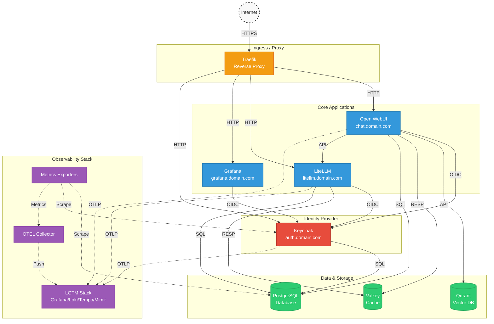

# Open WebUI Stack

Docker Compose stack for [Open WebUI](https://github.com/open-webui/open-webui) with LiteLLM proxy, observability, and security best practices.

## Architecture



## Features

- **Traefik Reverse Proxy**: Automatic HTTPS with self-signed certificates generated by Traefik, HTTP to HTTPS redirect
- **LiteLLM Proxy**: Unified gateway for multiple LLM providers (OpenAI, Anthropic, Gemini, Ollama)
- **Keycloak Identity Provider**: Single Sign-On (SSO) for all services
- **LGTM Observability Stack**: Grafana, Loki, Tempo, Mimir for logs, traces, and metrics
- **Qdrant Vector Database**: Production-ready vector search for RAG
- **PostgreSQL**: Shared database for Open WebUI, LiteLLM, and Keycloak
- **OpenTelemetry**: Full observability with distributed tracing
- **Security**: Network isolation, secure headers, rate limiting, admin IP restriction

##  Quick Start

### Prerequisites

- Docker Engine 24.0+
- Docker Compose v2.20+
- 8GB+ RAM recommended
- (Optional) NVIDIA GPU with drivers for GPU metrics

### Installation

1. **Clone the repository**
   ```bash
   git clone https://github.com/mhajder/openwebui-stack.git
   cd openwebui-stack
   ```

2. **Run the setup script**
   ```bash
   chmod +x scripts/*.sh
   ./scripts/setup.sh
   ```

In `docker-compose.yml` change `ENABLE_SIGNUP` to `true` if you want to register the first admin user via Open WebUI. You can disable it again after the first user is created.

3. **Start the stack**
   ```bash
   docker compose --profile monitoring --profile gpu up -d
   ```

4. **Access the services**
   - Open WebUI: https://chat.localhost
   - Grafana: https://grafana.localhost
   - LiteLLM: https://litellm.localhost
   - Keycloak (admin): https://auth.localhost/admin

### Local Domain Resolution

Add these entries to your `/etc/hosts`:
```
127.0.0.1 localhost chat.localhost grafana.localhost litellm.localhost auth.localhost traefik.localhost
```

## Keycloak SSO

This stack includes **Keycloak** for centralized authentication (Single Sign-On). All services authenticate through Keycloak instead of using separate credentials.

### Services Integrated with Keycloak

| Service | URL | Client ID | Redirect URI |
|---------|-----|-----------|--------------|
| Open WebUI | https://chat.example.com | `open-webui` | `/oauth/oidc/callback` |
| Grafana | https://grafana.example.com | `grafana` | `/login/generic_oauth` |
| LiteLLM | https://litellm.example.com | `litellm` | `/sso/callback` |

### Keycloak Administration

Access the Keycloak Admin Console to manage users and applications:

- **URL**: https://auth.example.com/admin
- **Username**: `admin` (or `KEYCLOAK_ADMIN_USER`)
- **Password**: Set during setup (`KEYCLOAK_ADMIN_PASSWORD`)

### First-Time Setup

1. After starting the stack, run the configuration script:
   ```bash
   ./scripts/configure-keycloak-clients.sh
   ```
   This automatically:
   - Creates OIDC clients for Grafana, Open WebUI, and LiteLLM
   - Creates `admin` and `user` groups
   - Adds a groups protocol mapper to include group membership in tokens
   - Saves client secrets to `.env`

2. Alternatively, the setup script can do this automatically when prompted.

### Role Mapping

Users are assigned roles based on their Keycloak group membership:

| Keycloak Group | Open WebUI Role | LiteLLM Role |
|----------------|-----------------|--------------|
| `admin` | Admin | `proxy_admin` |
| `user` | User | `internal_user` |

**Creating Users:**

1. Go to Keycloak Admin Console → Users → Add user
2. Fill in user details and save
3. Go to Credentials tab → Set password (uncheck "Temporary")
4. Go to Groups tab → Join the appropriate group (`admin` or `user`)

### SSO Login Flow

**Open WebUI:**
1. Navigate to https://chat.localhost
2. Click "Continue with Keycloak"
3. Enter Keycloak credentials
4. Redirected back to Open WebUI, logged in

**LiteLLM:**
1. Navigate to https://litellm.localhost/ui
2. Click SSO login button
3. Enter Keycloak credentials
4. Redirected back to LiteLLM, logged in

**Grafana:**
1. Navigate to https://grafana.localhost
2. Click "Sign in with Keycloak"
3. Enter Keycloak credentials
4. Redirected back to Grafana, logged in

### Security Features

Keycloak includes several security hardening options:

- **Admin IP Restriction**: Restrict access to the admin console by IP
  - Set `KEYCLOAK_ADMIN_IP_RANGE` in `.env` (e.g., `10.0.0.0/8`)
  - Default: `0.0.0.0/0` (allow all)

- **Security Headers**: Strict HTTP security headers configured via Traefik

- **Resource Limits**: Memory and CPU limits applied to Keycloak container

### Realm Import

To import a pre-configured realm:
1. Place your `realm-export.json` file in `keycloak/import/`
2. Keycloak will automatically import it on startup

### Backups

Keycloak database backups can be run on-demand:
```bash
# Run backup
docker compose --profile backup up keycloak-backup

# List backups
docker volume ls | grep keycloak_backups
```

Configure retention with `BACKUP_RETENTION_DAYS` in `.env` (default: 7 days)

## Configuration

### Environment Variables

Key environment variables in `.env`:

| Variable | Description | Example |
|----------|-------------|---------|
| `COMPOSE_PROJECT_NAME` | Docker Compose project name | `openwebui-stack` |
| `DOMAIN` | Base domain for services | `localhost` or `example.com` |
| `POSTGRES_USER` | PostgreSQL admin user | `postgres` |
| `POSTGRES_PASSWORD` | PostgreSQL admin password | Generated by setup script |
| `OPENWEBUI_DB_NAME` | Open WebUI database name | `openwebui` |
| `OPENWEBUI_DB_USER` | Open WebUI database user | `openwebui` |
| `OPENWEBUI_DB_PASSWORD` | Open WebUI database password | Generated by setup script |
| `LITELLM_DB_NAME` | LiteLLM database name | `litellm` |
| `LITELLM_DB_USER` | LiteLLM database user | `litellm` |
| `LITELLM_DB_PASSWORD` | LiteLLM database password | Generated by setup script |
| `OPENWEBUI_SECRET_KEY` | Secret key for Open WebUI sessions | Generated by setup script |
| `LITELLM_MASTER_KEY` | Master API key for LiteLLM | Generated by setup script |
| `LITELLM_SALT_KEY` | Salt key for LiteLLM encryption | Generated by setup script |
| `TRAEFIK_DASHBOARD_USER` | Traefik dashboard username | `admin` |
| `TRAEFIK_DASHBOARD_PASSWORD` | Traefik dashboard password (plain) | Generated by setup script |
| `TRAEFIK_DASHBOARD_PASSWORD_HASH` | Traefik dashboard password (apr1 hash) | Auto-generated by setup script |
| `GF_SECURITY_ADMIN_PASSWORD` | Grafana admin password | Generated by setup script |
| `KEYCLOAK_DB_PASSWORD` | Keycloak database password | Generated by setup script |
| `KEYCLOAK_ADMIN_PASSWORD` | Keycloak admin password | Generated by setup script |
| `KEYCLOAK_ADMIN_IP_RANGE` | Allowed IPs for admin console | `0.0.0.0/0` (all) |
| `OPENWEBUI_OIDC_CLIENT_SECRET` | Open WebUI OIDC client secret | Auto-configured |
| `LITELLM_OIDC_CLIENT_SECRET` | LiteLLM OIDC client secret | Auto-configured |
| `GF_OIDC_CLIENT_SECRET` | Grafana OIDC client secret | Auto-configured |
| `SSL_CERT_TYPE` | SSL certificate type | `selfsigned`, `existing`, `traefik` |

### Services Overview

#### Core Services

- **Traefik**: Reverse proxy with automatic HTTPS, routing, and load balancing
- **Open WebUI**: Web UI for interacting with LLMs (chat.domain.com)
- **LiteLLM**: Unified gateway for multiple LLM providers (litellm.domain.com)
- **Keycloak**: Identity provider for SSO (auth.domain.com)
- **PostgreSQL**: Shared relational database for Open WebUI, LiteLLM, and Keycloak
- **Valkey**: High-performance Redis alternative for caching and sessions

#### Storage & Search

- **Qdrant**: Vector database for semantic search and RAG operations

#### Observability (LGTM Stack)

- **LGTM** (Grafana OTel): Integrated stack providing:
  - **Prometheus/Mimir**: Metrics collection and storage
  - **Loki**: Centralized log aggregation
  - **Tempo**: Distributed tracing
  - **Grafana**: Visualization and dashboards

#### Exporters & Collectors

- **Node Exporter**: System-level metrics (CPU, memory, disk, network)
- **OpenTelemetry Collector**: Collects and forwards metrics, logs, and traces
- **PostgreSQL Exporter** (optional profile): Database metrics
- **NVIDIA GPU Exporter** (optional profile): GPU metrics (requires GPU)

### Production Deployment

For production environments:

1. **Use proper certificates**
   - **Option A**: Use existing wildcard certificates
     - Place your certificate and key files in the `certs/` directory
     - During setup, select option 1 to use existing certificates
     - Supported formats: `.crt`, `.key`, `.pem`, `.fullchain.pem`
   - **Option B**: Generate self-signed certificates (development only)
     - The setup script can generate persistent self-signed certificates
   - **Option C**: Let's Encrypt (requires public domain)
     - Update [traefik/traefik.yml](traefik/traefik.yml) for ACME configuration
     - Example ACME configuration:
     ```yaml
     certificatesResolvers:
       letsencrypt:
         acme:
           email: admin@example.com
           storage: /data/acme.json
           httpChallenge:
             entryPoint: web
     ```

2. **Update security settings**
   - Change default passwords in `.env` (setup script generates strong ones automatically)
   - Enable authentication on all service dashboards
   - Configure rate limiting and WAF rules in Traefik

3. **Enable GPU support** (if available)
   ```bash
   docker compose --profile gpu up -d
   ```
   This activates the NVIDIA GPU Exporter for monitoring GPU metrics.

4. **Configure persistent backups**
   - Use external volume drivers for data persistence
   - Set up automated backup scripts using cron
   - Store backups in secure, off-site locations

5. **Network security**
   - Use VPN or IP whitelisting for external access
   - Configure firewall rules (UFW, iptables)
   - Use private networks when possible

6. **Database optimization**
   - Configure PostgreSQL replication for HA
   - Set up automated backup and recovery procedures
   - Monitor database performance and storage

7. **Monitoring and alerting**
   - Configure alert rules in Grafana for critical metrics
   - Set up notification channels (email, Slack, PagerDuty)
   - Implement log retention policies in Loki

8. **Keycloak SSO**
   - Run `./scripts/configure-keycloak-clients.sh` to set up OIDC clients
   - Configure admin IP restriction via `KEYCLOAK_ADMIN_IP_RANGE`
   - Monitor authentication via the Keycloak dashboard in Grafana
   - Set up automated backups with the backup profile

## Monitoring

### Grafana Dashboards

Access Grafana at **https://grafana.localhost** with default credentials:
- **Username**: `admin`
- **Password**: Set in `.env` as `GF_SECURITY_ADMIN_PASSWORD` (generated by setup script)

#### Pre-configured Dashboards

The stack includes several pre-configured dashboards:

1. **litellm-dashboard.json** - LiteLLM proxy metrics and performance
   - Request rates and latencies
   - Token usage and costs
   - Error rates by model
   - Model provider health

2. **node-exporter-dashboard.json** - System metrics
   - CPU, memory, and disk usage
   - Network I/O
   - Process metrics
   - System uptime

3. **openwebui-dashboard.json** - Open WebUI application metrics
   - Request rates and response times
   - User activity
   - Message counts
   - API endpoint performance

4. **postgresql-dashboard.json** - Database metrics
   - Query performance
   - Connection pool status
   - Cache hit rates
   - Replication lag (if configured)

5. **traefik-dashboard.json** - Reverse proxy metrics
   - Request rates by service
   - Response time percentiles
   - HTTP status codes
   - SSL/TLS certificate expiry

6. **opentelemetry-dashboard.json** - System-wide observability
   - Distributed traces
   - Span analysis
   - Service dependencies
   - Error tracking

7. **nvidia-dcgm-dashboard.json** - GPU metrics (if GPU profile enabled)
   - GPU memory usage
   - Compute utilization
   - Temperature monitoring
   - Power consumption

8. **keycloak-dashboard.json** - Keycloak authentication monitoring
   - Login attempts (success/failed)
   - Active sessions
   - Database connection pool
   - JVM memory usage
   - Failed login alerts

### Available Metrics

**Prometheus/Mimir** stores these metric types:

| Category | Metrics |
|----------|---------|
| **System** | CPU load, memory usage, disk I/O, network traffic |
| **Database** | Connection count, query latency, transaction rate |
| **HTTP** | Request rate, response time, status codes, error rate |
| **Cache** | Hit/miss rates, eviction rates, memory usage |
| **Application** | Custom metrics from services |
| **GPU** | Memory usage, compute, temperature, power (if enabled) |

### Traces in Tempo

OpenTelemetry traces are automatically collected and stored in Tempo:

- Access via Grafana → Explore → Tempo
- View distributed traces across all services
- Analyze service dependencies
- Identify performance bottlenecks
- Track errors through the system

## Additional Resources

- [Open WebUI Documentation](https://docs.openwebui.com/)
- [LiteLLM Proxy Docs](https://docs.litellm.ai/docs/proxy/configs)
- [Keycloak Documentation](https://www.keycloak.org/documentation)
- [Keycloak Server Installation Guide](https://www.keycloak.org/server/installation)
- [Traefik Documentation](https://traefik.io/traefik/)
- [Grafana LGTM Stack](https://grafana.com/products/lgtm-stack/)
- [Qdrant Documentation](https://qdrant.tech/documentation/)
- [OpenTelemetry](https://opentelemetry.io/)

## License

This project is licensed under the MIT License - see the [LICENSE](LICENSE) file for details.
